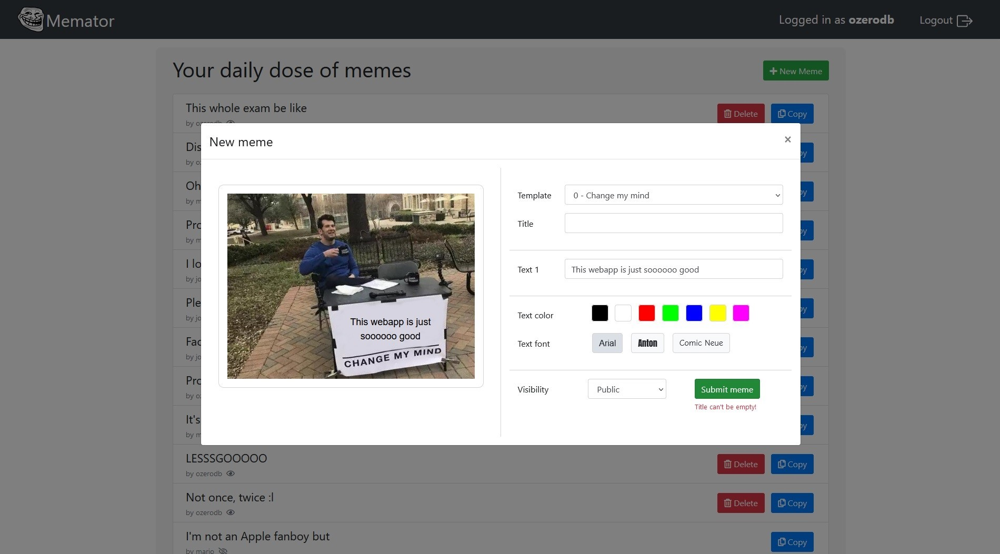

# Exam #2: "Meme Generator"

## Student: s292425 BONACCORSI DAMIANO

## React Client Application Routes

- Route `/memes`: home page with list of memes
- Route `/create`: page to create a meme (new or copy) for authenticated users (nb: in this application, users are creators, there is no admins or other types of users)
- Route `/login`: login page

## API Server

- POST `/api/sessions`

  - request body:

    ```json
    {
      "username": "ozerodb@outlook.com",
      "password": "password"
    }
    ```

  - response: `200 OK` or `401 Unauthorized`.
  - response body: _authenticated user info_

    ```json
    {
      "id": "1",
      "username": "ozerodb@outlook.com",
      "name": "ozerodb"
    }
    ```

- DELETE `/api/sessions/current`
  - request parameters and request body: _None_
  - response: `200 OK` or `401 Unauthorized`.
  - response body: _None_
- GET `/api/sessions/current`

  - request parameters and request body: _None_
  - response: `200 OK` or `401 Unauthorized`.
  - response body: _authenticated user info_

    ```json
    {
      "id": "1",
      "username": "ozerodb@outlook.com",
      "name": "ozerodb"
    }
    ```

- GET `/api/memes`
  - request parameters and request body: _None_
  - response: `200 OK` or `500 Internal Server Error`
  - response body: _an array of memes_

    ```json
    [
    {"id":21,"title":"This whole exam be like","creatorId":1,"creatorName":"ozerodb","templateId":4,"isPublic":1,"text1":"a fun and interesting exam","text2":"an hecc lot of memes","text3":"","color":"#FFFFFF","fontFamily":"Comic Sans MS, Comic Sans, cursive"},
    {"id":23,"title":"Oh no..","creatorId":3,"creatorName":"mario","templateId":3,"isPublic":1,"text1":"The exam went poorly","text2":"You scored a 10","text3":"It's out of 30","color":"#FF0000","fontFamily":"Arial, sans-serif"},
    {"id":25,"title":"I love them","creatorId":2,"creatorName":"john","templateId":0,"isPublic":1,"text1":"Inline conditionals aren't less readable","text2":"","text3":"","color":"#0000FF","fontFamily":"Impact, fantasy"},
    {"id":26,"title":"Please don't do this to me","creatorId":2,"creatorName":"john","templateId":6,"isPublic":1,"text1":"accept a bad grade","text2":"","text3":"","color":"#FF00FF","fontFamily":"Comic Sans MS, Comic Sans, cursive"},
    {"id":29,"title":"It's difficult being old","creatorId":3,"creatorName":"mario","templateId":6,"isPublic":1,"text1":"stop doing all-nighters before every exam","text2":"","text3":"","color":"#FF0000","fontFamily":"Comic Sans MS, Comic Sans, cursive"},
    {"id":30,"title":"LESSSGOOOOO","creatorId":1,"creatorName":"ozerodb","templateId":1,"isPublic":1,"text1":"It's coming home","text2":"It's coming Rome","text3":"","color":"#000000","fontFamily":"Arial, sans-serif"},
    {"id":32,"title":"Not once, twice :l","creatorId":1,"creatorName":"ozerodb","templateId":3,"isPublic":1,"text1":"you have an exam tomorrow","text2":"you studied a lot and you feel confident in your preparation","text3":"you forgot to book for it","color":"#000000","fontFamily":"Arial, sans-serif"}
    ]
    ```

- DELETE `/api/memes/:id`
  - request parameter: _meme's id_
  - response: `200 OK` or `401 Unauthorized` or `500 Internal Server Error`
  - response body: _None_
- POST `/api/new_meme`
  - request body: _a meme object_

  ```json
  {"title":"Example","creatorId":1,"creatorName":"ozerodb","templateId":0,"isPublic":1,"text1":"You can't change my mind","text2":"","text3":"","color":"#000000","fontFamily":"Impact, fantasy"},
  ```
  
  - response: `200 OK` or `401 Unauthorized` or `500 Internal Server Error`
  - response body: _None_

## Database Tables

- Table `users` - contains users' `id`, `name`, `email`, `password` (hashed)
- Table `memes` - contains memes' `id`, `title`, `creatorId`, `templateId`, `isPublic`, `text1`, `text2`, `text3`, `color`, `fontFamily`

## Main React Components

- `Meme` (in `meme.js`): this component takes as props the info about a meme (including the template info) and returns an image with overlaid texts.
- `MemeModal` (in `meme.js`): this component takes as props the info about a meme (including the template info) and returns a `Modal` with a `Meme` component inside.
- `MemesList` (in `meme.js`): this component takes as props an array of memes' info, and the info about the current user. It returns a list of items including the meme's title and creator, and if the user is authenticated it includes the meme's visibility and the utility buttons.
- `MemeCreator` (in `meme.js`): this component takes as props an array of templates, and the info about the current user. It returns a `Modal` consisting of a `Meme` component on the left, to be used as a preview, and a `Form` on the right, to be used as an editor to modify the meme. If the `location.prefill` hook is defined, the `MemeCreator` works in copy mode.

## Screenshot



## Users Credentials and list of memes

- `ozerodb@outlook.com`, `password`
  - **This whole exam be like** _(public)_
  - **Dissing** _(protected)_
  - **Professionals have standards** _(protected)_
  - **LESSSGOOOOO** _(public)_
  - **Not once, twice :l** _(public)_
- `john.doe@gmail.com`, `password`
  - **I love them** _(public)_
  - **Please don't do this to me** _(public)_
  - **Facts** _(protected)_
- `mario.rossi@polito.it`, `password`
  - **Oh no..** _(public)_
  - **Professionals have standards** _(protected)_
  - **It's difficult being old** _(public)_
  - **I'm not an Apple fanboy but** _(protected)_

_(Yes, the password is `password` for all of them)_
